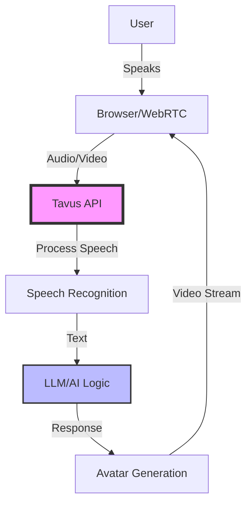
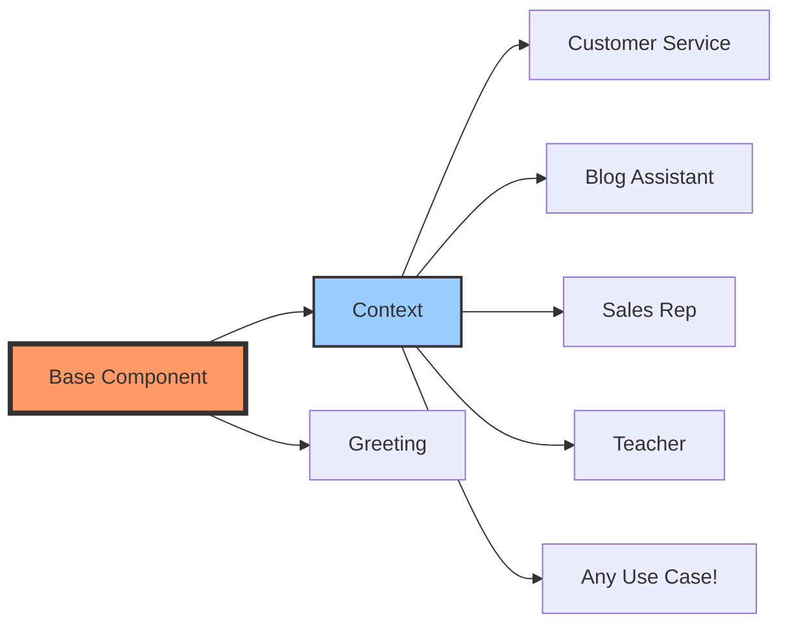
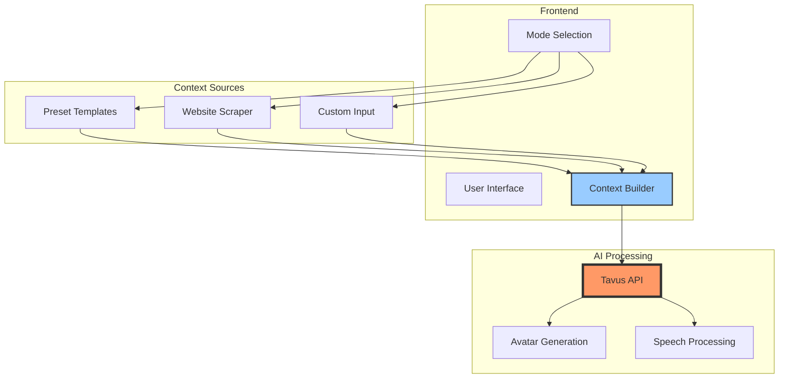
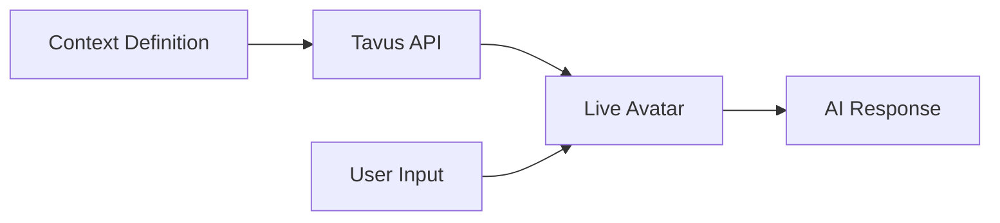
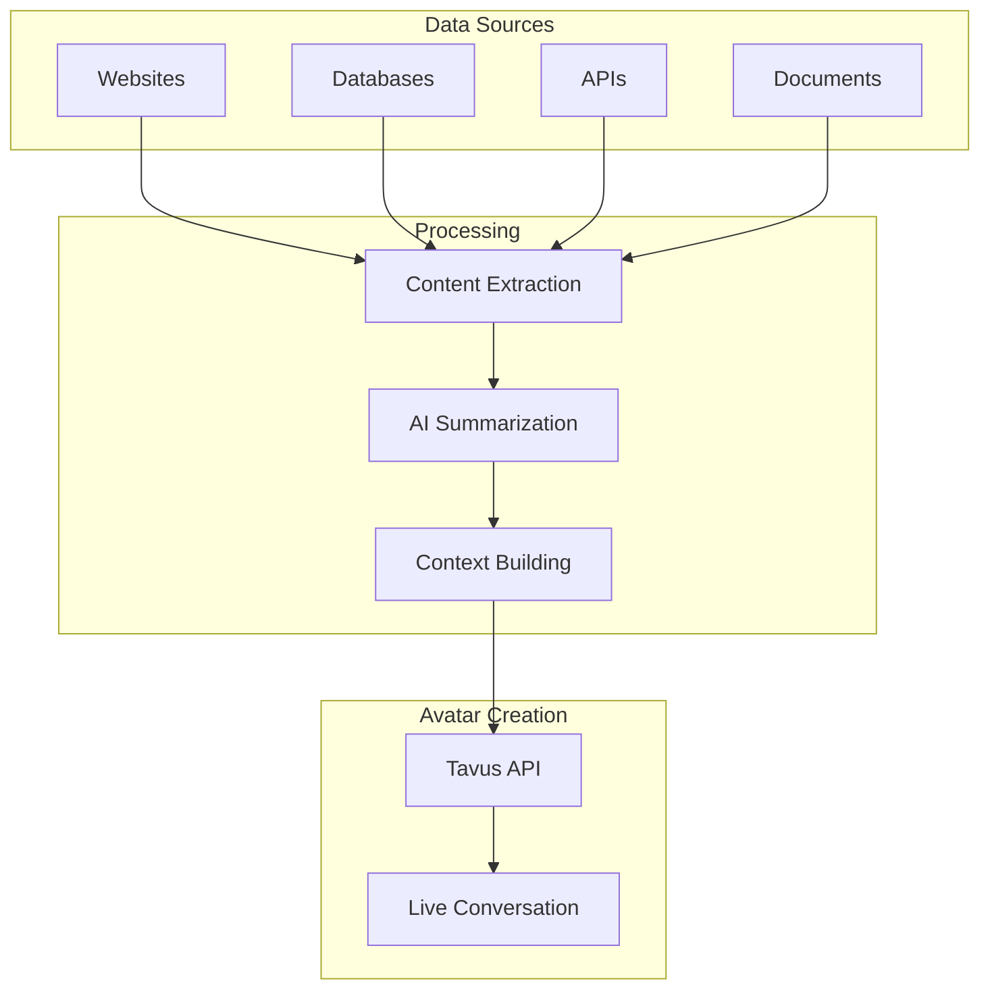

# Build Extensible AI Avatars with Tavus: From Simple Chat to Website Expert

## YouTube Script & Blog Post

### Video Title
"Build ANY AI Avatar in 20 Minutes - Customer Service, Blog Assistant, or Anything! (Tavus + Next.js)"

### Video Description
Learn the fundamentals of building extensible AI avatars with Tavus! Whether you want a customer service chatbot, a blog post assistant, or any other conversational AI - this tutorial shows you the core patterns. We'll start with a basic implementation, then extend it to create an AI that can learn from any website.

---

## [00:00] Introduction & Hook

**[Show montage of different AI avatar use cases]**

"Imagine if you could create a customer service chatbot that actually talks to your customers through video... or an AI assistant that can discuss your blog posts with readers... or literally any conversational AI avatar for your specific needs.

Today, I'm going to show you the fundamentals of building extensible AI avatars with Tavus. By the end of this video, you'll understand the core patterns that let you build ANY type of conversational AI - and I'll prove it by extending our basic avatar to automatically learn from websites.

Here's what we're building..."

**[Demo: Show basic avatar, then show it discussing a website]**

## [01:30] What You'll Learn (Architecture Overview)

"Before we code, let's understand the architecture:"



"The beauty of Tavus is it handles all the complex WebRTC, speech recognition, and avatar generation. You just need to:
1. Create a conversation
2. Customize the AI behavior
3. Embed the video interface

Let's build it!"

## [02:30] Project Setup

"First, let's create a Next.js project:"

```bash
npx create-next-app@latest ai-avatar-demo --typescript --tailwind --app
cd ai-avatar-demo
```

"For this tutorial, you'll need:
- A Tavus account (free trial available)
- A Tavus replica (your AI avatar)
- Node.js 18+"

## [03:00] Environment Setup

"Create a `.env.local` file:"

```bash
# .env.local
NEXT_PUBLIC_TAVUS_API_KEY=your_tavus_api_key_here
NEXT_PUBLIC_TAVUS_API_URL=https://tavusapi.com
NEXT_PUBLIC_TAVUS_REPLICA_ID=your_replica_id_here
```

**[Screen recording: Getting API keys from Tavus dashboard]**

## [04:00] Core Tavus Integration

"Let's create the core Tavus service. This is the foundation for ANY avatar you want to build:"

```typescript
// lib/tavus.ts
interface TavusConfig {
  apiKey: string;
  apiUrl: string;
}

interface CreateConversationParams {
  replica_id: string;
  persona_id?: string;
  conversation_name?: string;
  conversational_context?: string;
  custom_greeting?: string;
}

interface CreateConversationResponse {
  conversation_id: string;
  conversation_url: string;
  status: string;
}

class TavusAPI {
  private config: TavusConfig;

  constructor() {
    this.config = {
      apiKey: process.env.NEXT_PUBLIC_TAVUS_API_KEY || '',
      apiUrl: process.env.NEXT_PUBLIC_TAVUS_API_URL || 'https://tavusapi.com',
    };
  }

  private async makeRequest<T>(
    endpoint: string,
    method: string = 'GET',
    body?: any
  ): Promise<T> {
    const response = await fetch(`${this.config.apiUrl}${endpoint}`, {
      method,
      headers: {
        'Content-Type': 'application/json',
        'x-api-key': this.config.apiKey,
      },
      body: body ? JSON.stringify(body) : undefined,
    });

    if (!response.ok) {
      const error = await response.text();
      throw new Error(`Tavus API error: ${response.status} - ${error}`);
    }

    return response.json();
  }

  async createConversation(params: CreateConversationParams): Promise<CreateConversationResponse> {
    return this.makeRequest<CreateConversationResponse>(
      '/v2/conversations',
      'POST',
      params
    );
  }
}

export const tavusAPI = new TavusAPI();
```

"This service is the foundation. Notice how `conversational_context` and `custom_greeting` let you customize the AI's behavior - this is KEY to making it extensible!"

## [06:00] Basic Conversation Component

"Now let's create a reusable conversation component:"

```typescript
// components/TavusConversation.tsx
'use client';

import { useEffect, useRef, useState } from 'react';
import { tavusAPI } from '@/lib/tavus';

interface TavusConversationProps {
  replicaId: string;
  context?: string;
  greeting?: string;
  onConversationEnd?: () => void;
  className?: string;
}

export default function TavusConversation({
  replicaId,
  context = "You are a helpful AI assistant.",
  greeting = "Hello! How can I help you today?",
  onConversationEnd,
  className = '',
}: TavusConversationProps) {
  const iframeRef = useRef<HTMLIFrameElement>(null);
  const [conversationUrl, setConversationUrl] = useState<string | null>(null);
  const [loading, setLoading] = useState(true);
  const [error, setError] = useState<string | null>(null);

  useEffect(() => {
    startConversation();
  }, [replicaId, context]);

  const startConversation = async () => {
    try {
      setLoading(true);
      setError(null);

      const response = await tavusAPI.createConversation({
        replica_id: replicaId,
        conversation_name: 'AI Avatar Session',
        conversational_context: context,
        custom_greeting: greeting,
      });

      if (response.conversation_url) {
        setConversationUrl(response.conversation_url);
      }
    } catch (err) {
      setError(err instanceof Error ? err.message : 'Failed to start conversation');
      console.error('Error starting Tavus conversation:', err);
    } finally {
      setLoading(false);
    }
  };

  if (loading) {
    return (
      <div className={`flex items-center justify-center p-8 ${className}`}>
        <div className="animate-spin rounded-full h-12 w-12 border-b-2 border-gray-900"></div>
      </div>
    );
  }

  if (error) {
    return (
      <div className={`flex items-center justify-center p-8 ${className}`}>
        <div className="text-red-600 text-center">
          <p className="font-semibold">Connection Error</p>
          <p className="text-sm mt-2">{error}</p>
        </div>
      </div>
    );
  }

  return (
    <div className={`relative ${className}`}>
      <iframe
        ref={iframeRef}
        src={conversationUrl}
        className="w-full h-full border-0 rounded-lg"
        allow="camera; microphone; display-capture"
        style={{ minHeight: '600px' }}
      />
    </div>
  );
}
```

## [08:00] Basic Implementation - Customer Service Bot

"Let's create our first use case - a customer service avatar:"

```typescript
// app/page.tsx
'use client';

import { useState } from 'react';
import TavusConversation from '@/components/TavusConversation';

export default function Home() {
  const [avatarType, setAvatarType] = useState<'customer-service' | 'blog' | 'custom'>('customer-service');
  const [customContext, setCustomContext] = useState('');
  const [showConversation, setShowConversation] = useState(false);

  const avatarConfigs = {
    'customer-service': {
      context: `You are a friendly customer service representative for TechCorp. 
        Be helpful, professional, and empathetic. You can help with:
        - Product information
        - Order status
        - Technical support
        - Returns and refunds
        Always maintain a positive tone and try to resolve issues efficiently.`,
      greeting: "Hello! Welcome to TechCorp support. How can I assist you today?"
    },
    'blog': {
      context: `You are an AI assistant that helps people understand blog posts.
        You're knowledgeable, engaging, and can explain complex topics simply.
        Ask clarifying questions and provide examples when helpful.`,
      greeting: "Hi! I'm here to discuss any blog post with you. What would you like to talk about?"
    },
    'custom': {
      context: customContext || "You are a helpful AI assistant.",
      greeting: "Hello! How can I help you today?"
    }
  };

  const startChat = () => {
    if (avatarType === 'custom' && !customContext) {
      alert('Please provide context for your custom avatar');
      return;
    }
    setShowConversation(true);
  };

  if (showConversation) {
    const config = avatarConfigs[avatarType];
    return (
      <div className="min-h-screen bg-gray-50 p-8">
        <div className="max-w-4xl mx-auto">
          <div className="mb-4 flex justify-between items-center">
            <h1 className="text-2xl font-bold">AI Avatar Chat</h1>
            <button
              onClick={() => setShowConversation(false)}
              className="px-4 py-2 bg-red-500 text-white rounded hover:bg-red-600"
            >
              End Chat
            </button>
          </div>
          <div className="bg-white rounded-lg shadow-lg overflow-hidden">
            <TavusConversation
              replicaId={process.env.NEXT_PUBLIC_TAVUS_REPLICA_ID!}
              context={config.context}
              greeting={config.greeting}
              className="w-full h-[600px]"
            />
          </div>
        </div>
      </div>
    );
  }

  return (
    <div className="min-h-screen bg-gray-50 p-8">
      <div className="max-w-2xl mx-auto">
        <h1 className="text-3xl font-bold mb-8 text-center">
          Create Your AI Avatar
        </h1>
        
        <div className="bg-white rounded-lg shadow-lg p-6 space-y-6">
          <div>
            <label className="block text-sm font-medium mb-3">
              Choose Avatar Type
            </label>
            <div className="space-y-3">
              <label className="flex items-center p-3 border rounded-lg cursor-pointer hover:bg-gray-50">
                <input
                  type="radio"
                  value="customer-service"
                  checked={avatarType === 'customer-service'}
                  onChange={(e) => setAvatarType(e.target.value as any)}
                  className="mr-3"
                />
                <div>
                  <div className="font-medium">Customer Service Bot</div>
                  <div className="text-sm text-gray-600">Professional support representative</div>
                </div>
              </label>
              
              <label className="flex items-center p-3 border rounded-lg cursor-pointer hover:bg-gray-50">
                <input
                  type="radio"
                  value="blog"
                  checked={avatarType === 'blog'}
                  onChange={(e) => setAvatarType(e.target.value as any)}
                  className="mr-3"
                />
                <div>
                  <div className="font-medium">Blog Discussion Assistant</div>
                  <div className="text-sm text-gray-600">Discuss and explain blog posts</div>
                </div>
              </label>
              
              <label className="flex items-center p-3 border rounded-lg cursor-pointer hover:bg-gray-50">
                <input
                  type="radio"
                  value="custom"
                  checked={avatarType === 'custom'}
                  onChange={(e) => setAvatarType(e.target.value as any)}
                  className="mr-3"
                />
                <div>
                  <div className="font-medium">Custom Avatar</div>
                  <div className="text-sm text-gray-600">Define your own AI personality</div>
                </div>
              </label>
            </div>
          </div>

          {avatarType === 'custom' && (
            <div>
              <label className="block text-sm font-medium mb-2">
                Custom Context
              </label>
              <textarea
                value={customContext}
                onChange={(e) => setCustomContext(e.target.value)}
                className="w-full p-3 border rounded-lg"
                rows={4}
                placeholder="Describe your AI avatar's personality, knowledge, and behavior..."
              />
            </div>
          )}

          <button
            onClick={startChat}
            className="w-full py-3 bg-blue-500 text-white rounded-lg hover:bg-blue-600 font-medium"
          >
            Start Conversation
          </button>
        </div>
      </div>
    </div>
  );
}
```

## [12:00] Understanding the Extensibility Pattern

"Notice the pattern here - we can create ANY type of avatar by just changing the context and greeting. This is the power of Tavus!"



## [14:00] Advanced Extension: Website Knowledge Avatar

"Now let's extend this to create an avatar that can learn from any website. We'll add Firecrawl for web scraping and OpenAI for processing:"

```bash
npm install @mendable/firecrawl-js openai
```

"Update your `.env.local`:"

```bash
# Add these to your existing .env.local
FIRECRAWL_API_KEY=your_firecrawl_api_key_here
OPENAI_API_KEY=your_openai_api_key_here
```

## [15:00] Web Scraping Service

"Let's add a service to scrape and understand websites:"

```typescript
// lib/website-analyzer.ts
import FirecrawlApp from '@mendable/firecrawl-js';
import OpenAI from 'openai';

const firecrawl = new FirecrawlApp({ apiKey: process.env.FIRECRAWL_API_KEY || '' });
const openai = new OpenAI({ apiKey: process.env.OPENAI_API_KEY || '' });

export async function analyzeWebsite(url: string): Promise<string> {
  try {
    // Scrape the website
    const scrapeResult = await firecrawl.crawlUrl(url, {
      limit: 5,
      scrapeOptions: {
        formats: ['markdown'],
      }
    });

    if (!scrapeResult.success || !scrapeResult.data) {
      throw new Error('Failed to scrape website');
    }

    // Combine content from pages
    const combinedContent = scrapeResult.data
      .map((page: any) => page.markdown || '')
      .join('\n\n')
      .substring(0, 10000); // Limit for API

    // Use AI to create a summary
    const completion = await openai.chat.completions.create({
      model: 'gpt-3.5-turbo',
      messages: [
        {
          role: 'system',
          content: 'Create a comprehensive summary of this website for an AI avatar to use when answering questions.'
        },
        {
          role: 'user',
          content: combinedContent
        }
      ],
      max_tokens: 1000,
    });

    return completion.choices[0].message.content || 'No summary generated';
  } catch (error) {
    console.error('Error analyzing website:', error);
    throw error;
  }
}
```

## [16:00] Enhanced UI with Website Learning

"Now let's update our UI to support website learning:"

```typescript
// app/page.tsx (enhanced version)
'use client';

import { useState } from 'react';
import TavusConversation from '@/components/TavusConversation';
import { analyzeWebsite } from '@/lib/website-analyzer';

export default function Home() {
  const [mode, setMode] = useState<'preset' | 'website'>('preset');
  const [avatarType, setAvatarType] = useState<'customer-service' | 'blog' | 'custom'>('customer-service');
  const [customContext, setCustomContext] = useState('');
  const [websiteUrl, setWebsiteUrl] = useState('');
  const [isAnalyzing, setIsAnalyzing] = useState(false);
  const [websiteContext, setWebsiteContext] = useState('');
  const [showConversation, setShowConversation] = useState(false);

  // ... (previous avatar configs) ...

  const analyzeWebsiteAndStart = async () => {
    if (!websiteUrl) {
      alert('Please enter a website URL');
      return;
    }

    setIsAnalyzing(true);
    try {
      const context = await analyzeWebsite(websiteUrl);
      setWebsiteContext(context);
      setShowConversation(true);
    } catch (error) {
      alert('Failed to analyze website');
    } finally {
      setIsAnalyzing(false);
    }
  };

  if (showConversation) {
    const config = mode === 'website' 
      ? {
          context: `You are an AI expert about ${websiteUrl}. Use this knowledge to answer questions: ${websiteContext}`,
          greeting: `Hello! I've learned all about ${new URL(websiteUrl).hostname}. What would you like to know?`
        }
      : avatarConfigs[avatarType];

    return (
      <div className="min-h-screen bg-gray-50 p-8">
        <div className="max-w-4xl mx-auto">
          <div className="mb-4 flex justify-between items-center">
            <h1 className="text-2xl font-bold">
              {mode === 'website' ? `Expert on ${new URL(websiteUrl).hostname}` : 'AI Avatar Chat'}
            </h1>
            <button
              onClick={() => {
                setShowConversation(false);
                setWebsiteContext('');
              }}
              className="px-4 py-2 bg-red-500 text-white rounded hover:bg-red-600"
            >
              End Chat
            </button>
          </div>
          <div className="bg-white rounded-lg shadow-lg overflow-hidden">
            <TavusConversation
              replicaId={process.env.NEXT_PUBLIC_TAVUS_REPLICA_ID!}
              context={config.context}
              greeting={config.greeting}
              className="w-full h-[600px]"
            />
          </div>
        </div>
      </div>
    );
  }

  return (
    <div className="min-h-screen bg-gray-50 p-8">
      <div className="max-w-2xl mx-auto">
        <h1 className="text-3xl font-bold mb-8 text-center">
          Create Your AI Avatar
        </h1>
        
        <div className="bg-white rounded-lg shadow-lg p-6 space-y-6">
          {/* Mode Selection */}
          <div className="flex gap-4 p-1 bg-gray-100 rounded-lg">
            <button
              onClick={() => setMode('preset')}
              className={`flex-1 py-2 rounded ${mode === 'preset' ? 'bg-white shadow' : ''}`}
            >
              Preset Avatars
            </button>
            <button
              onClick={() => setMode('website')}
              className={`flex-1 py-2 rounded ${mode === 'website' ? 'bg-white shadow' : ''}`}
            >
              Learn from Website
            </button>
          </div>

          {mode === 'preset' ? (
            <>
              {/* Previous preset avatar selection UI */}
              <div>
                <label className="block text-sm font-medium mb-3">
                  Choose Avatar Type
                </label>
                {/* ... (previous radio buttons) ... */}
              </div>

              {avatarType === 'custom' && (
                <div>
                  <label className="block text-sm font-medium mb-2">
                    Custom Context
                  </label>
                  <textarea
                    value={customContext}
                    onChange={(e) => setCustomContext(e.target.value)}
                    className="w-full p-3 border rounded-lg"
                    rows={4}
                    placeholder="Describe your AI avatar's personality..."
                  />
                </div>
              )}

              <button
                onClick={() => setShowConversation(true)}
                className="w-full py-3 bg-blue-500 text-white rounded-lg hover:bg-blue-600"
              >
                Start Conversation
              </button>
            </>
          ) : (
            <>
              <div>
                <label className="block text-sm font-medium mb-2">
                  Website URL
                </label>
                <input
                  type="url"
                  value={websiteUrl}
                  onChange={(e) => setWebsiteUrl(e.target.value)}
                  className="w-full p-3 border rounded-lg"
                  placeholder="https://example.com"
                />
                <p className="text-sm text-gray-600 mt-2">
                  The AI will learn from this website and answer questions about it
                </p>
              </div>

              <button
                onClick={analyzeWebsiteAndStart}
                disabled={isAnalyzing}
                className="w-full py-3 bg-green-500 text-white rounded-lg hover:bg-green-600 disabled:opacity-50"
              >
                {isAnalyzing ? 'Analyzing Website...' : 'Create Website Expert'}
              </button>
            </>
          )}
        </div>
      </div>
    </div>
  );
}
```

## [18:00] Architecture Deep Dive

"Let's visualize how our extensible system works:"



## [19:00] Key Takeaways & Best Practices

"Here are the fundamentals for building ANY AI avatar with Tavus:"

### 1. **Context is Everything**
The `conversational_context` parameter defines your avatar's entire personality and knowledge base.

### 2. **Start Simple, Extend Gradually**
Begin with basic contexts, then add complexity as needed.

### 3. **Common Use Cases Pattern**
```typescript
const avatarTemplates = {
  customerService: {
    context: "Professional, helpful, company-specific knowledge...",
    greeting: "Welcome! How can I assist you?"
  },
  salesRep: {
    context: "Persuasive, product-focused, benefit-driven...",
    greeting: "Hi! I'd love to tell you about our solutions!"
  },
  teacher: {
    context: "Patient, educational, encouraging...",
    greeting: "Hello! Ready to learn something new?"
  },
  therapist: {
    context: "Empathetic, supportive, good listener...",
    greeting: "Hi, I'm here to listen. How are you feeling?"
  }
};
```

### 4. **Dynamic Knowledge Integration**
You can integrate any data source:
- Databases
- APIs
- Documents
- Websites
- Real-time data

## [20:00] Conclusion & Next Steps

"You now have the fundamentals to build ANY type of AI avatar! The pattern is always the same:
1. Define the context
2. Set the greeting
3. Create the conversation

Some ideas to explore:
- Connect to your company's knowledge base
- Create multi-lingual avatars
- Add memory between conversations
- Integrate with your CRM or support tools

The possibilities are endless because Tavus handles all the complex parts - you just bring the context!"

---

## Blog Post Version

# Building Extensible AI Avatars with Tavus: The Complete Guide

Whether you're building a customer service chatbot, a blog post assistant, or any other conversational AI, the fundamentals remain the same. In this guide, I'll show you how to create extensible AI avatars using Tavus, starting with the basics and then extending to advanced use cases.

## Why Tavus?

Tavus provides the infrastructure for real-time conversational AI avatars:
- WebRTC video streaming
- Speech recognition and synthesis
- Natural conversation flow with interruption handling
- Customizable AI behavior

You focus on defining the AI's personality and knowledge - Tavus handles the rest.

## The Core Pattern

Every AI avatar follows this pattern:



The magic is in the context definition. This determines:
- What the avatar knows
- How it behaves
- Its personality and tone
- Its specific capabilities

## Getting Started

### Prerequisites
- Node.js 18+
- Tavus account and API key
- A Tavus replica (your avatar's appearance)

### Basic Setup

First, create a Next.js project:

```bash
npx create-next-app@latest ai-avatar-demo --typescript --tailwind --app
cd ai-avatar-demo
```

Set up your environment variables:

```bash
# .env.local
NEXT_PUBLIC_TAVUS_API_KEY=your_key_here
NEXT_PUBLIC_TAVUS_API_URL=https://tavusapi.com
NEXT_PUBLIC_TAVUS_REPLICA_ID=your_replica_id
```

### Core Implementation

Create the Tavus service (`lib/tavus.ts`):

```typescript
class TavusAPI {
  private config: TavusConfig;

  constructor() {
    this.config = {
      apiKey: process.env.NEXT_PUBLIC_TAVUS_API_KEY || '',
      apiUrl: process.env.NEXT_PUBLIC_TAVUS_API_URL || '',
    };
  }

  async createConversation(params: CreateConversationParams) {
    const response = await fetch(`${this.config.apiUrl}/v2/conversations`, {
      method: 'POST',
      headers: {
        'Content-Type': 'application/json',
        'x-api-key': this.config.apiKey,
      },
      body: JSON.stringify(params),
    });

    if (!response.ok) {
      throw new Error(`Tavus API error: ${response.status}`);
    }

    return response.json();
  }
}
```

Create the conversation component (`components/TavusConversation.tsx`):

```typescript
export default function TavusConversation({
  replicaId,
  context,
  greeting,
}: TavusConversationProps) {
  const [conversationUrl, setConversationUrl] = useState<string | null>(null);

  useEffect(() => {
    const startConversation = async () => {
      const response = await tavusAPI.createConversation({
        replica_id: replicaId,
        conversational_context: context,
        custom_greeting: greeting,
      });
      
      setConversationUrl(response.conversation_url);
    };

    startConversation();
  }, [replicaId, context, greeting]);

  if (!conversationUrl) return <div>Loading...</div>;

  return (
    <iframe
      src={conversationUrl}
      className="w-full h-full border-0"
      allow="camera; microphone"
    />
  );
}
```

## Use Case Examples

### Customer Service Bot

```typescript
const customerServiceAvatar = {
  context: `You are a professional customer service representative.
    - Be helpful and empathetic
    - Know our product catalog and policies
    - Escalate complex issues appropriately
    - Always maintain a positive tone`,
  greeting: "Hello! Welcome to our support. How can I help you today?"
};
```

### Blog Discussion Assistant

```typescript
const blogAssistant = {
  context: `You are an engaging blog discussion facilitator.
    - Ask thought-provoking questions
    - Provide additional context when needed
    - Encourage deeper exploration of topics
    - Reference related articles when relevant`,
  greeting: "Hi! I'd love to discuss any blog post with you. What are you reading?"
};
```

### Technical Documentation Helper

```typescript
const docsHelper = {
  context: `You are a technical documentation assistant.
    - Explain complex concepts clearly
    - Provide code examples
    - Suggest best practices
    - Help troubleshoot common issues`,
  greeting: "Hello! I'm here to help you navigate our documentation. What are you looking for?"
};
```

## Advanced Extension: Learning from Websites

Want your avatar to instantly become an expert on any website? Here's how:

### Install Additional Dependencies

```bash
npm install @mendable/firecrawl-js openai
```

### Create Website Analyzer

```typescript
// lib/website-analyzer.ts
export async function analyzeWebsite(url: string): Promise<string> {
  // Scrape website content
  const scrapeResult = await firecrawl.crawlUrl(url, {
    limit: 5,
    scrapeOptions: { formats: ['markdown'] }
  });

  // Process with AI
  const completion = await openai.chat.completions.create({
    model: 'gpt-3.5-turbo',
    messages: [
      {
        role: 'system',
        content: 'Summarize this website content for an AI avatar.'
      },
      {
        role: 'user',
        content: scrapeResult.data.map(page => page.markdown).join('\n')
      }
    ]
  });

  return completion.choices[0].message.content;
}
```

### Dynamic Avatar Creation

```typescript
const websiteExpert = {
  context: `You are an expert on ${websiteUrl}. 
    Your knowledge includes: ${await analyzeWebsite(websiteUrl)}
    Answer questions accurately and reference specific features.`,
  greeting: `Hello! I've studied ${websiteUrl} and can answer any questions about it!`
};
```

## Architecture for Scale



## Best Practices

### 1. Context Design
- Be specific about the avatar's role
- Include examples of desired behavior
- Set clear boundaries
- Provide relevant knowledge

### 2. Performance
- Cache analyzed content
- Limit context size (Tavus has limits)
- Use streaming for real-time data

### 3. User Experience
- Always provide clear greetings
- Handle errors gracefully
- Show loading states
- Allow conversation ending

### 4. Security
- Validate all inputs
- Sanitize scraped content
- Use environment variables for keys
- Implement rate limiting

## Deployment

Deploy to Vercel:

```bash
vercel deploy
```

Remember to add environment variables in your Vercel dashboard.

## Conclusion

The pattern is simple but powerful:
1. Define context (personality + knowledge)
2. Create conversation with Tavus
3. Embed the video interface

This foundation lets you build ANY type of conversational AI avatar. Whether it's customer service, education, sales, or something entirely unique - the pattern remains the same.

The real innovation comes from how you source and structure the context. Connect to your data sources, define the personality, and let Tavus handle the complex parts of making it conversational.

## What's Next?

- Add conversation memory with a database
- Implement multi-language support
- Create avatar templates for your team
- Build a marketplace of specialized avatars
- Integrate with your existing tools

The possibilities are endless when you understand the fundamentals. Start simple, then extend based on your needs.

---

*Ready to build your own AI avatar? Get started with Tavus today and transform how you interact with your users.*